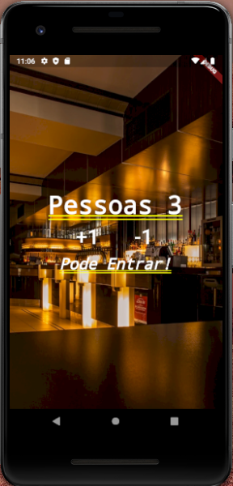

# Contador de pessoas

Um aplicativo simples desenvolvido utilizando Flutter. 

- Utilizando Stateful Widget
- Utilizando os widgets: 
- Padding
- Stack
- Image
- Row
- Column
- FlatButton
- Text

    

